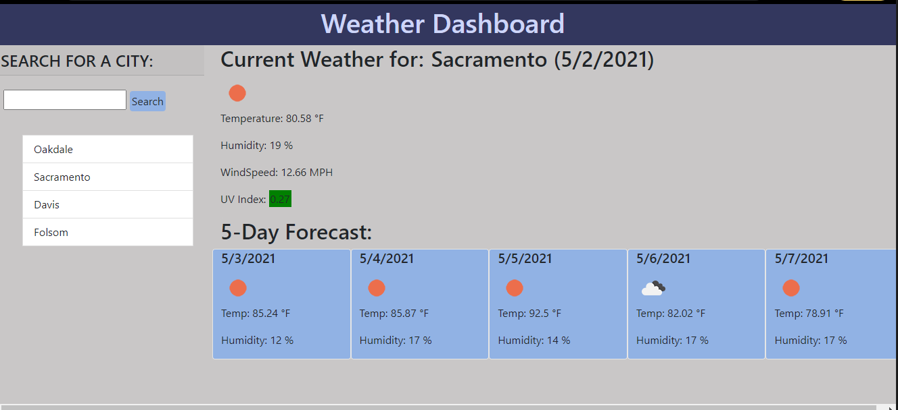

# 6-WeatherDashboard

## Description:
This is a weather dashboard that allows a user to search for a city and get current weather conditions as well as a 5-day forecast for that city. When searched, the city and date is displayed. Current weather conditions displayed include an icon representing the current weather, the temperature, the humidity, the wind speed, and the UV Index.  The UV index is displayed with a background color representing the severity of the current index with green being the least severe, then yellow, orange, red and finally purple being the most severe.  The 5-day forecast displays the date, an icon represenging weather conditions that day, the temperature, and the humidity.  Cities a user searches for are stored in local storage and displayed in a sidebar and can be clicked to get data for that city again. This app uses the Open Weather API to retrieve weather data for cities.  

## Technologies
This App was created with dynamically updated HTML and CSS powered by jQuery.  Bootstrap was utilized for layout. 

## Screenshot

## Link
https://melinamboedecker.github.io/6-WeatherDashboard/

## License
Copyright (c) 2021 Melina Boedecker
Licensed under the MIT license.